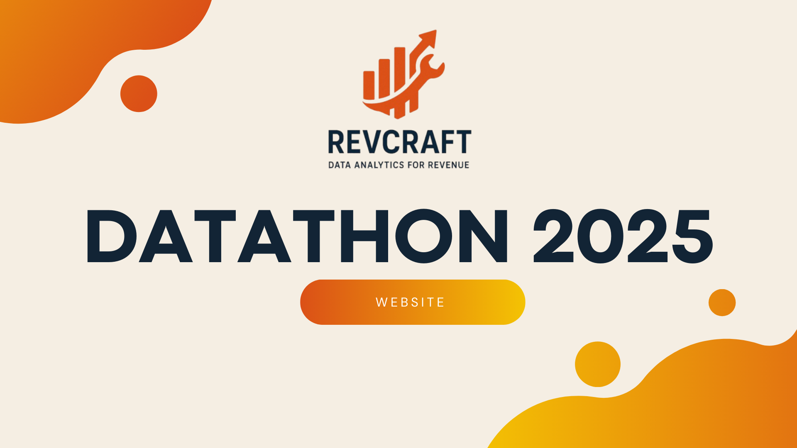

# RevCraft Consulting Report: Data Driven Strategies to Accelerate Modecraft's Ecommerce Revenue

  

Welcome to our project submission for the 6th DubsTech Datathon! We are revcraft✨! Click on the banner above !

## Project Overview

Modecraft (an anonymized real-world company) is an ecommerce store offering a wide range of household items. As part of the datathon, we analyzed their sales data to provide business recomendations from operational and marketing perspectives.

In this project, we focused on answering three main objectives:
- **Identifying seasonal trends** to optimize inventory and marketing planning for each year.
- **Analyzing optimal sales hours** to recommend more profitable store opening times.
- **Priortizing high-potential geographic locations and products** for marketing investment through a custom ProductScore metric.

## Methods and Tools Used
- Data Processing: Python
- Data Visualization: Tableau
- Report: HTML, CSS, Git Hub, Canva

## Key Deliverables
- Cleaned Data: Removing duplicates, blank entries, unavilable entries; generated new columns for metrics.
- Final report: Click on the banner above or access, <a href="https://tejasvi-konakanchi.github.io/Datathon_2025/" target="_blank">https://tejasvi-konakanchi.github.io/Datathon_2025/</a>

## How to View Our Work
- Full report: https://tejasvi-konakanchi.github.io/Datathon_2025/
- Visualizations: See charts in twb files

## Important Notes
- All work was completed within the DubsTech Datathon timeframe.
- Dataset was provided by ModeCraft(via competition organizers).

## Contact
For any questions, feel free to reach out to the respective role:

#### Team RevCraft
- Geith Amum - Machine Learning and Data Visualization - [geithamum1@gmail.com](geithamum1@gmail.com)!
- Tejasvi Konakanchi - Data Analysis, Project Management and Business Insights - [tkonak@uw.edu](mailto:tkonak@uw.edu)!
- Neil Bhalla - Data Analysis and Data Visualization - [neilb5@uw.edu](mailto:neilb5@uw.edu)!
- Trinity Kwon - Report Writing and Documentation - [trinik4@uw.edu](mailto:trinik4@uw.edu)!
- Nathan Dang - Data Analysis and Documentation - [natd0703@uw.edu](natd0703@uw.edu)!
