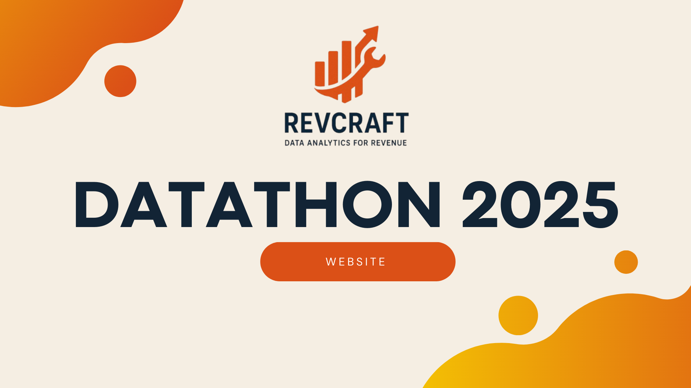

# 🎨RevCraft Consulting Report: Data Driven Strategies to Accelerate Modecraft's Ecommerce Revenue

<p align="center">
  <a href="https://www.google.com/webhp" target="_blank">
    
  </a>
</p>

Welcome to our project submission for the 6th DubsTech Datathon! We are revcraft✨!

## 📚Project Overview

Modecraft (an anonymized real-world company) is an ecommerce store offering a wide range of household items. As part of the datathon, we analyzed their sales data to provide business recomendations from operational and marketing perspectives.

In this project, we focused on answering three main objectives:
- **Identifying seasonal trends** to optimize inventory and marketing planning for each year.
- **Analyzing optimal sales hours** to recommend more profitable store opening times.
- **Priortizing high-potential geographic locations and products** for marketing investment through a custom ProductScore metric.

## 🛠Methods and Tools Used
- Data Processing: Python
- Data Visualization: Tableau
- Metric Creation: Custom Formula

## 📊Key Deliverables
- Cleaned Data: Removing duplicates, blank entries, unavilable entries; generated new columns for metrics.
- ProductScore Metric: Developed a formula for ranking products sold
- Final report:

## 📈Folder Structure
```
/Revcraft-Modecraft-Datathon
│
├── data/                # Original and cleaned datasets
├── notebooks/           # Jupyter notebooks with code
├── visualizations/      # Charts and graphs generated
├── report/              # Final written report (website)
├── README.md            # Project overview (this file)
└── requirements.txt     # Python dependencies (optional)
```

## 🚀How to View Our Work
- Full report: See website link.
- Visualizations: See charts in /visualization folder
- Code Notebooks: Explore analysis in yuh folder


## ✅Important Notes
- All work was completed within the DubsTech Datathon timeframe.
- No pre-existing work or external code bases used.
- Dataset was provided by ModeCraft(via competition organizers).

## 📬Contact
For any questions, feel free to reach out to the respective role:

#### 👥Team RevCraft
- Tejasvi Konakanchi - Data Analyst and Business Insights - [tkonak@uw.edu](mailto:tkonak@uw.edu)!
- Neil Bhalla - Data Visualization and Modelling - [neilb5@uw.edu](mailto:neilb5@uw.edu)!
- Trinity Kwon - Report Writing and Documentation - [trinik4@uw.edu](mailto:trinik4@uw.edu)!
- Geith Amum - Data Visualization and Statistical Analysis - [geithamum1@gmail.com](geithamum1@gmail.com)!
- Nathan Dang - Data Visualization, and Data Analysis - [natd0703@uw.edu](natd0703@uw.edu)!
